# Admin - Comprehensive Use Cases

## 1. User Management

### 1.1 Account Management
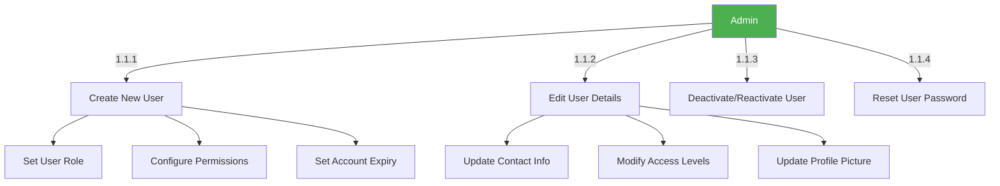

### 1.2 Role & Permission Management
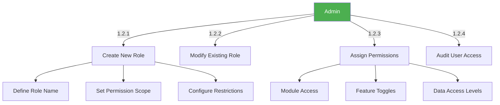

## 2. Property Management

### 2.1 Property Moderation
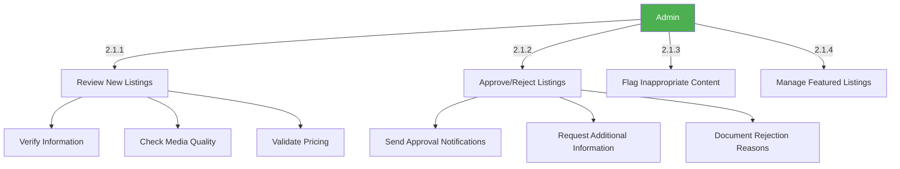

## 3. Financial Management

### 3.1 Transaction Monitoring
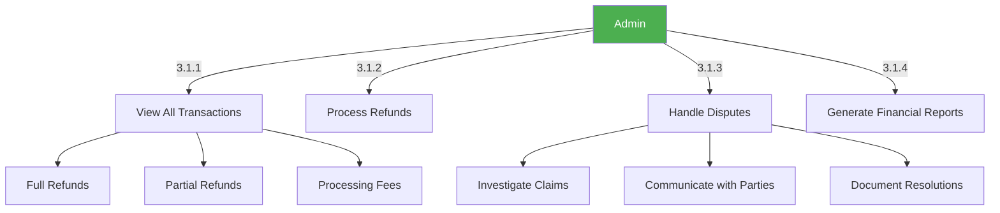

### 3.2 Payout Management
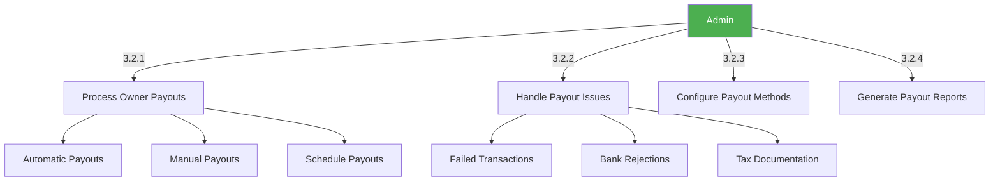

## 4. System Administration

### 4.1 System Configuration
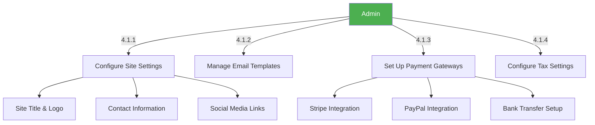

### 4.2 Security & Access Control
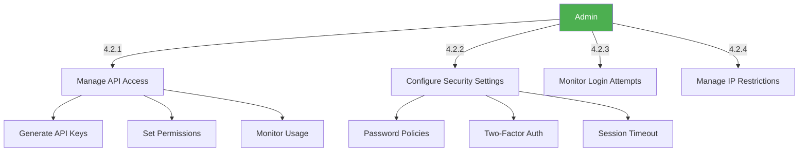

## 5. Support & Maintenance

### 5.1 Support Ticket Management
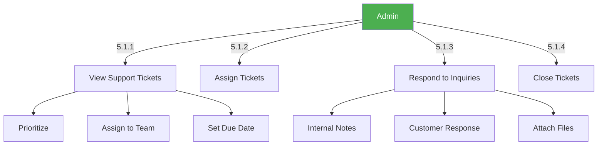

### 5.2 System Maintenance
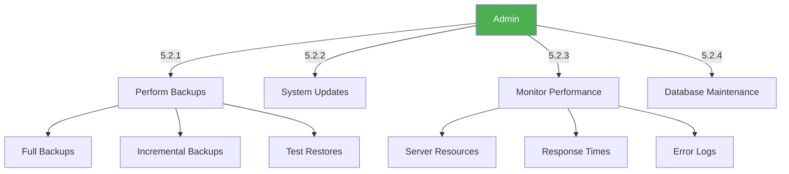

## 6. Reporting & Analytics

### 6.1 Business Intelligence
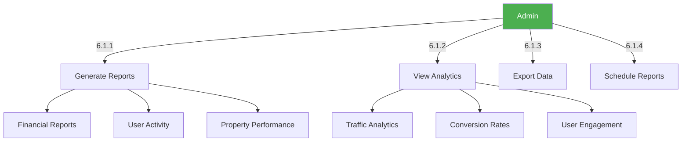

### 6.2 Audit Logs
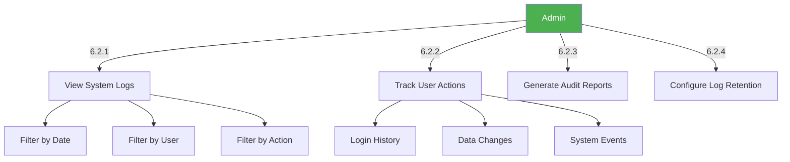
