# Owner - Complete Workflow Use Cases

## 1. Property Management

### 1.1 Property Listing & Setup
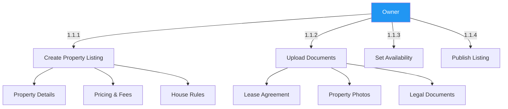

### 1.2 Application Management


## 2. Tenant Onboarding

### 2.1 Lease Creation
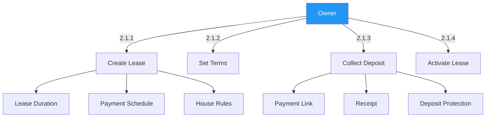

### 2.2 Move-in Process
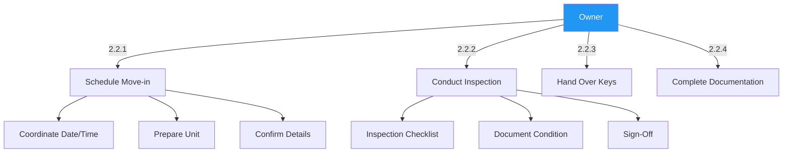

## 1. Property Management

### 1.1 Property Listing
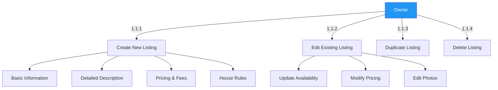

### 1.2 Media Management


## 2. Booking Management

### 2.1 Reservation Handling
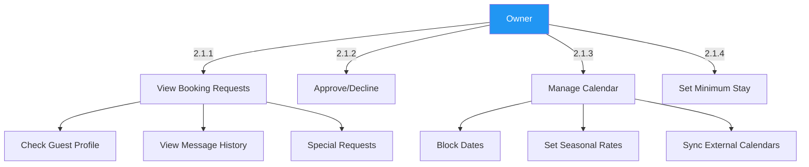

### 2.2 Pricing Strategy
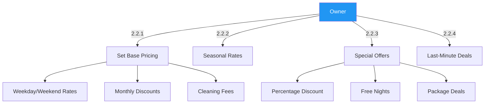

## 3. Rent Collection & Financials

### 3.1 Rent Collection
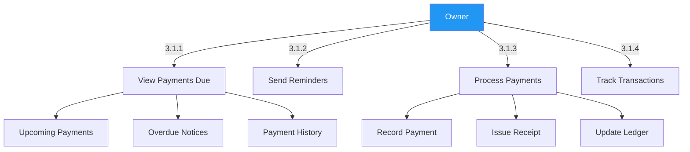

### 3.2 Security Deposit Management
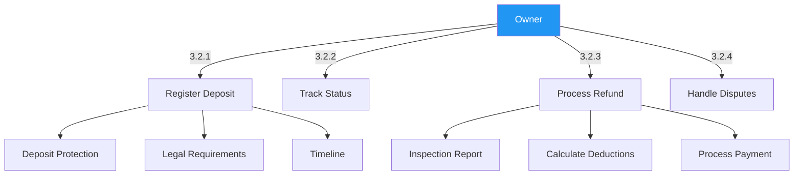

## 4. Property Maintenance

### 4.1 Maintenance Management
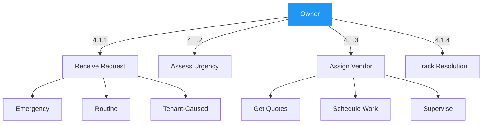

### 4.2 Property Inspections
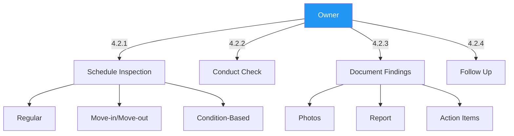

## 5. Lease Management

### 5.1 Lease Renewals
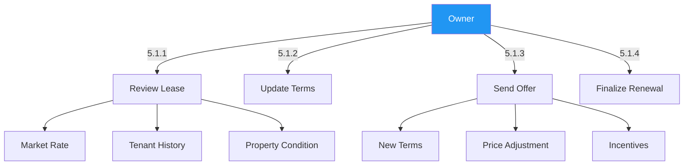

### 5.2 Move-out Process
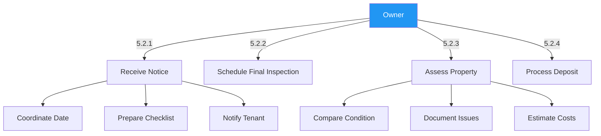

## 6. Financial Management

### 6.1 Income & Expenses
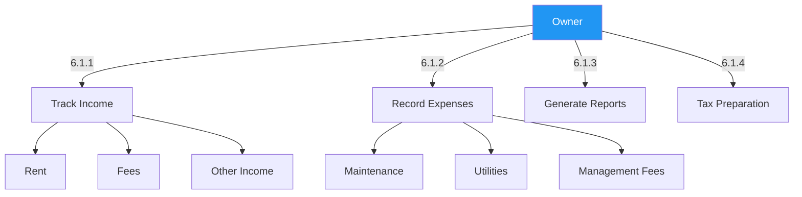

### 6.2 Financial Reporting
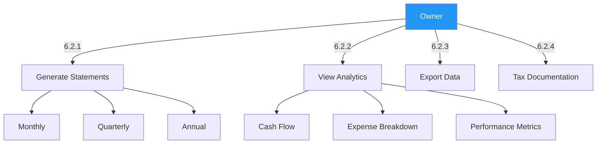
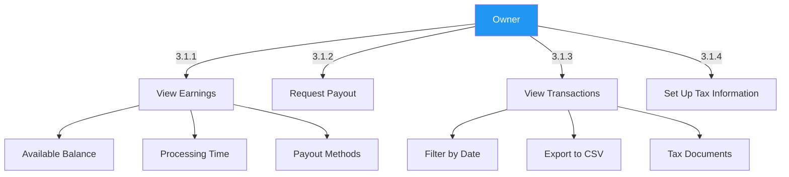

### 3.2 Expense Tracking
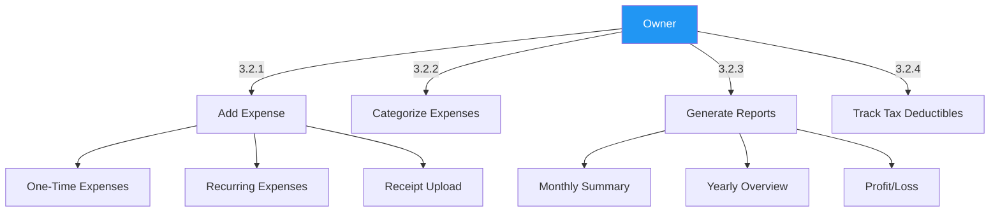

## 4. Guest Communication

### 4.1 Messaging System
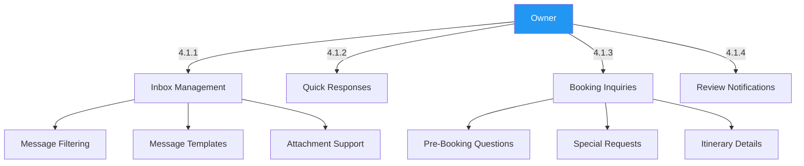

### 4.2 Review Management
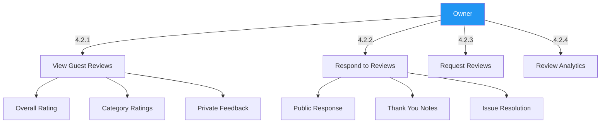

## 5. Property Maintenance

### 5.1 Maintenance Requests
```mermaid
graph TD
    A[Owner] -->|5.1.1| B[Submit Request]
    A -->|5.1.2| C[Track Progress]
    A -->|5.1.3| D[Approve Quotes]
    A -->|5.1.4| E[Maintenance History]
    
    B --> B1[Issue Description]
    B --> B2[Priority Level]
    B --> B3[Photo Upload]
    
    C --> C1[Assigned Technician]
    C --> C2[Status Updates]
    C --> C3[Completion Notes]
    
    style A fill:#2196F3,color:white
```

### 5.2 Property Inspections
```mermaid
graph TD
    A[Owner] -->|5.2.1| B[Schedule Inspection]
    A -->|5.2.2| C[Inspection Checklist]
    A -->|5.2.3| D[Document Findings]
    A -->|5.2.4| E[Create Work Orders]
    
    B --> B1[Regular Maintenance]
    B --> B2[Pre/Post Stay]
    B --> B3[Seasonal Checks]
    
    D --> D1[Photo Documentation]
    D --> D2[Condition Reports]
    D --> D3[Maintenance Recommendations]
    
    style A fill:#2196F3,color:white
```

## 6. Business Growth

### 6.1 Performance Analytics
```mermaid
graph TD
    A[Owner] -->|6.1.1| B[Occupancy Rates]
    A -->|6.1.2| C[Revenue Reports]
    A -->|6.1.3| D[Guest Demographics]
    A -->|6.1.4| E[Competitor Analysis]
    
    B --> B1[Daily/Monthly/Yearly]
    B --> B2[Seasonal Trends]
    B --> B3[Booking Lead Time]
    
    D --> D1[Guest Origin]
    D --> D2[Travel Purpose]
    D --> D3[Repeat Guest Rate]
    
    style A fill:#2196F3,color:white
```

### 6.2 Marketing Tools
```mermaid
graph TD
    A[Owner] -->|6.2.1| B[Promote Listing]
    A -->|6.2.2| C[Social Media Integration]
    A -->|6.2.3| D[Email Marketing]
    A -->|6.2.4| E[Special Promotions]
    
    B --> B1[Featured Listings]
    B --> B2[Ad Campaigns]
    B --> B3[SEO Optimization]
    
    D --> D1[Newsletter Templates]
    D --> D2[Guest Segments]
    D --> D3[Performance Tracking]
    
    style A fill:#2196F3,color:white
```
