# Tenant - Complete Workflow Use Cases

## 1. Property Search & Application

### 1.1 Property Search & Selection


### 1.2 Application Process
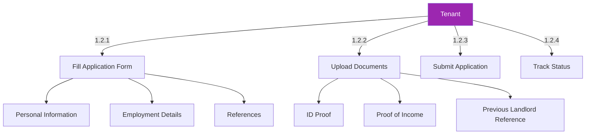

## 2. Lease Management

### 2.1 Lease Signing
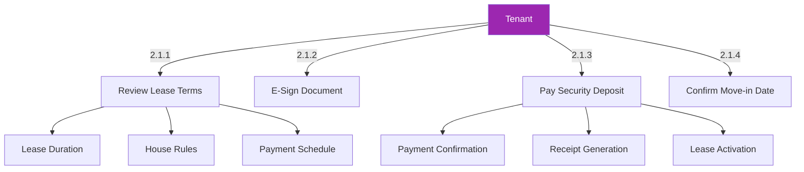

### 2.2 Lease Renewal
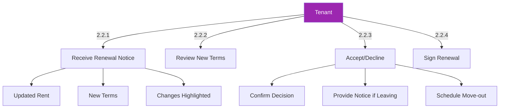

## 1. Property Search & Discovery

### 1.1 Property Search
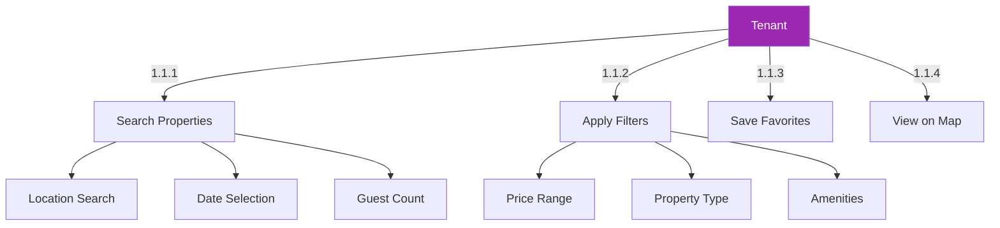

### 1.2 Property Comparison
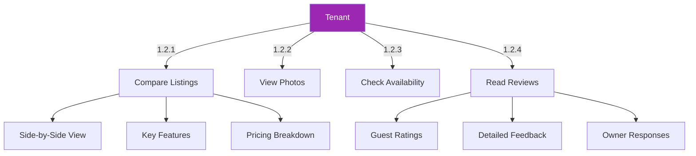

## 2. Booking Process

### 2.1 Reservation
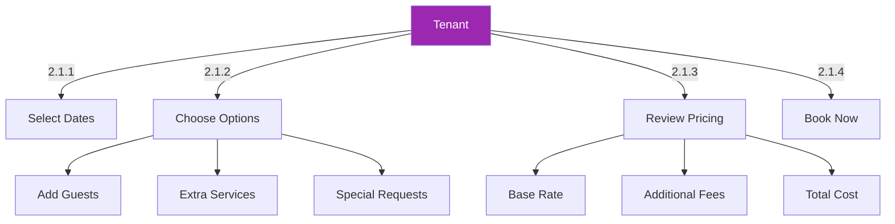

### 2.2 Payment & Confirmation
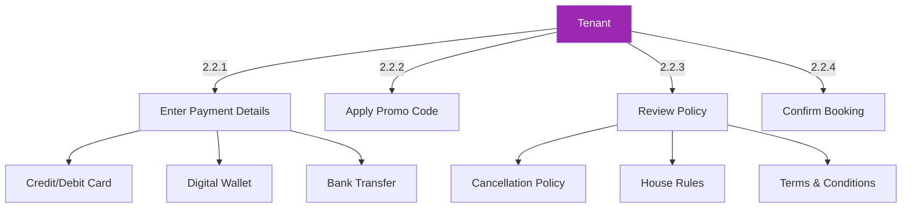

## 3. Rent & Payments

### 3.1 Payment Processing
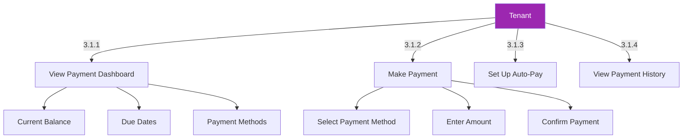

### 3.2 Security Deposit
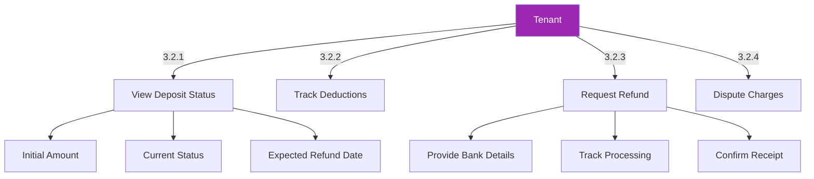

## 4. Move-in & Living

### 4.1 Move-in Process
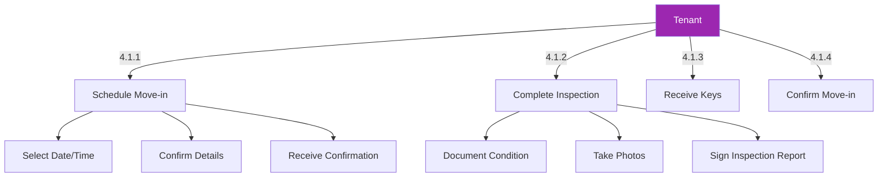

### 4.2 Maintenance Requests
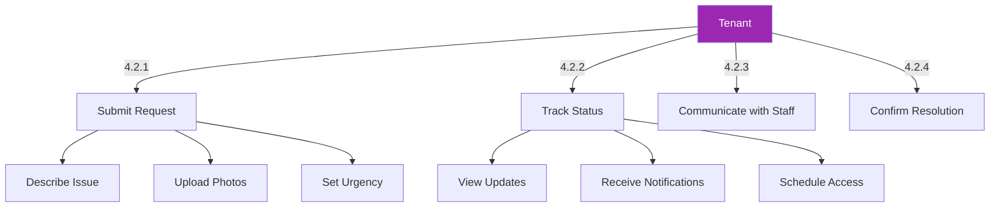

## 5. Move-out Process

### 5.1 Move-out Preparation
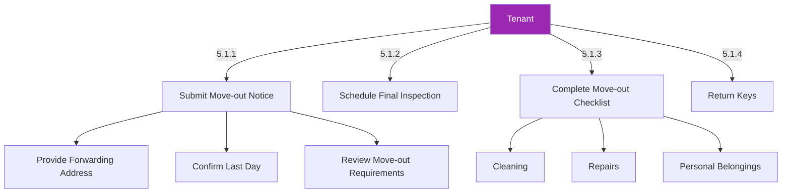

### 5.2 Deposit Refund
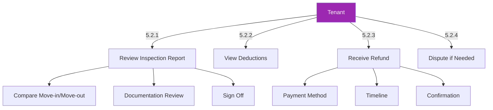

## 6. Account Management

### 3.1 Profile Settings
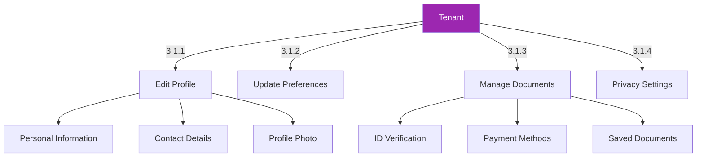

### 3.2 Notification Center
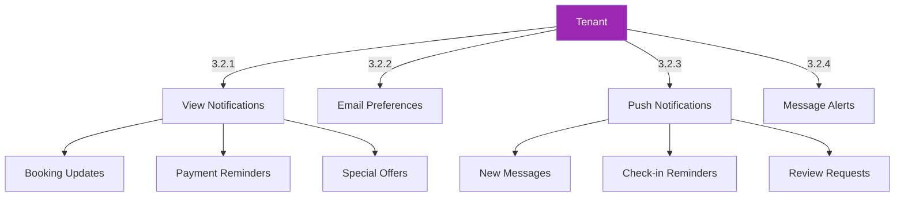

## 4. Stay Management

### 4.1 Pre-Arrival
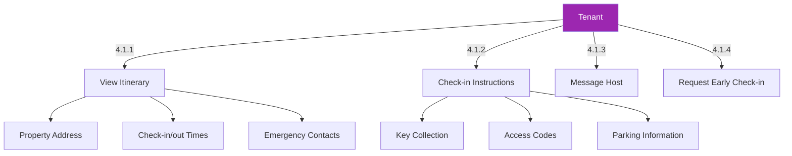

### 4.2 During Stay
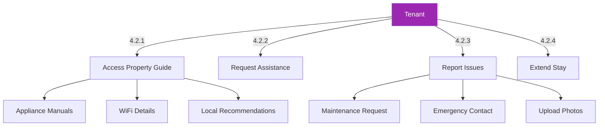

## 5. Payments & Billing

### 5.1 Payment Methods
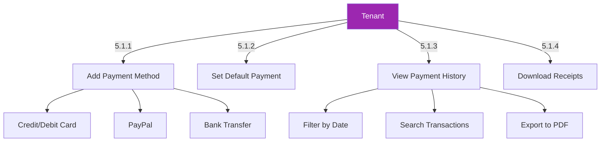

### 5.2 Security Deposits
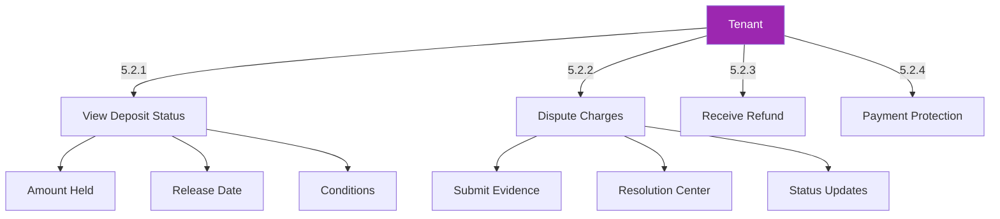

## 6. Reviews & Feedback

### 6.1 Leave a Review
```mermaid
graph TD
    A[Tenant] -->|6.1.1| B[Rate Property]
    A -->|6.1.2| C[Write Review]
    A -->|6.1.3| D[Upload Photos]
    A -->|6.1.4| E[Submit Feedback]
    
    B --> B1[Overall Rating]
    B --> B2[Cleanliness]
    B --> B3[Accuracy]
    
    C --> C1[Detailed Comments]
    C --> C2[Private Feedback]
    C --> C3[Tips for Future Guests]
    
    style A fill:#9C27B0,color:white
```

### 6.2 View Responses
```mermaid
graph TD
    A[Tenant] -->|6.2.1| B[Read Owner Responses]
    A -->|6.2.2| C[View Public Profile]
    A -->|6.2.3| D[Edit Review]
    A -->|6.2.4| E[Delete Review]
    
    B --> B1[Owner's Reply]
    B --> B2[Thank You Message]
    B --> B3[Follow-up Questions]
    
    D --> D1[Edit Window]
    D --> D2[Update Rating]
    D --> D3[Modify Text]
    
    style A fill:#9C27B0,color:white
```
